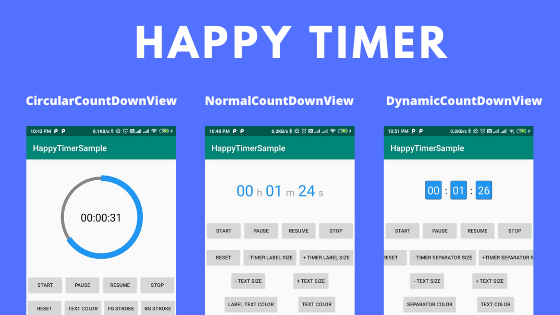

# HappyTimer- An Android Timer UI Library
[](https://www.android.com)
[](https://android-arsenal.com/api?level=21)
[](https://www.apache.org/licenses/LICENSE-2.0.html)
[](https://jitpack.io/#happysingh23828/HappyTimer)




## Prerequisites

Add this in your root `build.gradle` file (**not** your module `build.gradle` file):
```gradle
allprojects {
	repositories {
		...
		maven { url "https://jitpack.io" }
	}
}
```

## Dependency

Add this to your module's `build.gradle` file (make sure the version matches the JitPack badge above):

```gradle
dependencies {
	...
	implementation 'com.github.happysingh23828:HappyTimer:1.0.0'
}
```

## Documentation
In this library whole all the UI widgets are Using a common [HappyTimer.kt](https://github.com/happysingh23828/HappyTimer/blob/master/HappyTimer/src/main/java/com/androchef/happytimer/countdowntimer/HappyTimer.kt) for managing time. You can use that class directly
to implement your custom timer.

### HappyTimer.kt 

## Donation
If this project help you reduce time to develop, you can give me a cup of coffee :) 

<a href="https://www.buymeacoffee.com/UE8o2WT" target="_blank"></a>

## Contributing

Please fork this repository and contribute back using
[pull requests](https://github.com/happysingh23828/HappyTimer/pulls).

Any contributions, large or small, major features, bug fixes, are welcomed and appreciated
but will be thoroughly reviewed .

### Contact - Let's become friend
- [Androchef Blog](https://androchef.com/)
- [Androchef Youtube](https://www.youtube.com/channel/UCILhpbLSFkGzsiCYAeR30DA)
- [Github](https://github.com/happysingh23828)
- [Linkedin](https://www.linkedin.com/in/happpysingh23828/)


## License

* [Apache Version 2.0](http://www.apache.org/licenses/LICENSE-2.0.html)

```
Copyright 2019 Happy Singh

Licensed under the Apache License, Version 2.0 (the "License");
you may not use this file except in compliance with the License.
You may obtain a copy of the License at

 http://www.apache.org/licenses/LICENSE-2.0

Unless required by applicable law or agreed to in writing, software
distributed under the License is distributed on an "AS IS" BASIS,
WITHOUT WARRANTIES OR CONDITIONS OF ANY KIND, either express or implied.
See the License for the specific language governing permissions and
limitations under the License.
